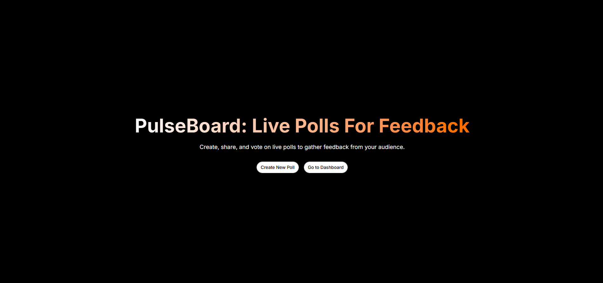

# PulseBoard - Live Polls For Feedback

<!-- Add your image here -->


PulseBoard is a full-stack web application that allows users to create, share, and vote on live polls in real-time. It features a comprehensive dashboard for poll management, real-time analytics using WebSockets, and public poll discovery.

## 🚀 Quick Access for Reviewers

To quickly explore the application without registering, use the following test credentials:
- **Email:** `ygshtest@gmail.com`
- **Password:** `Chaiaurcode26`

- https://pulse-board.ygshjm.dev/
---

## 💻 Tech Stack

### Frontend (Client)
- **Framework:** React.js (Vite)
- **Routing:** React Router v6
- **Styling:** Tailwind CSS & Shadcn UI
- **Real-time:** Socket.io-client
- **Charts:** Recharts
- **HTTP Client:** Axios
- **Icons:** Lucide React

### Backend (Server)
- **Runtime:** Node.js
- **Framework:** Express.js
- **Language:** TypeScript
- **Database:** MongoDB (via Mongoose)
- **Real-time:** Socket.io
- **Authentication:** JSON Web Tokens (JWT) & bcrypt
- **Validation:** Zod

---

## 📁 File Structure

### Frontend Structure
```
PulseBoard-Client/
├── src/
│   ├── api/             # Axios configuration and interceptors
│   ├── components/      # Reusable UI components (Shadcn, Header, etc.)
│   ├── constants/       # Global constants (e.g., Colors)
│   ├── hooks/           # Custom React hooks (useAuth)
│   ├── lib/             # Utility functions (Tailwind merge)
│   ├── pages/           # Main route components (Dashboard, CreatePoll, etc.)
│   ├── App.jsx          # Root component
│   └── main.jsx         # Entry point and Router configuration
```

### Backend Structure
```
PulseBoard/
├── src/
│   ├── common/          # Shared utilities across the app
│   │   ├── config/      # DB, CORS, Email, and Socket configurations
│   │   ├── middleware/  # Auth, validation, and error handling
│   │   └── utils/       # JWT helpers, hashing, custom API Error classes
│   ├── modules/         # Feature-based modular architecture
│   │   ├── auth/        # Auth logic, routes, controllers, and Zod DTOs
│   │   └── poll/        # Poll logic, models, controllers, and routes
│   ├── app.ts           # Express app setup and middleware wiring
│   └── server.ts        # Server entry point and DB connection
```

---
